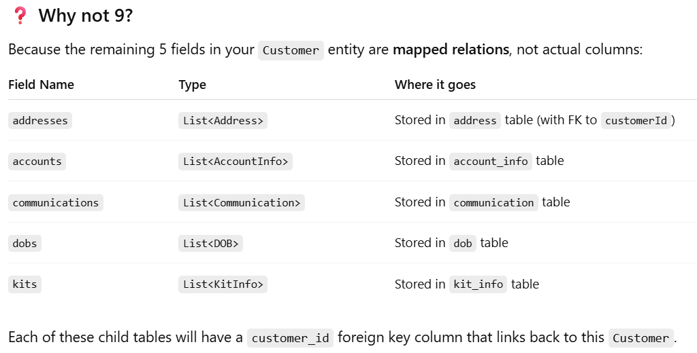
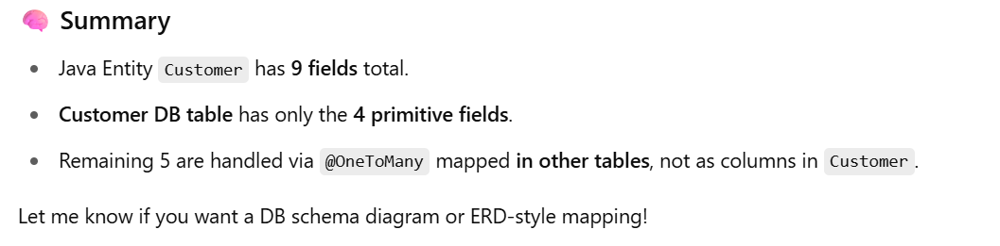
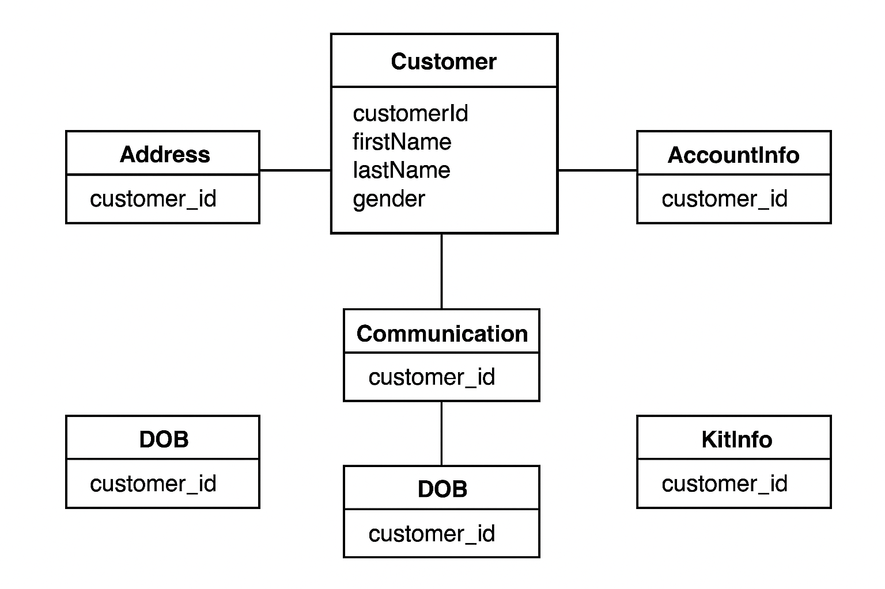
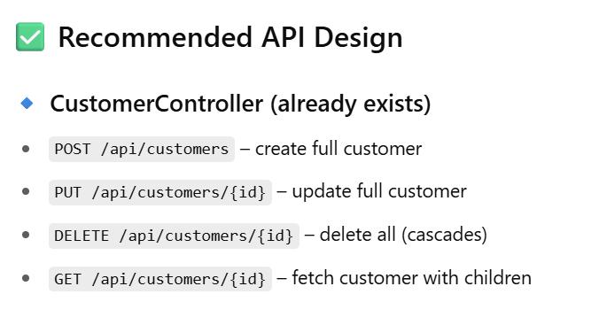
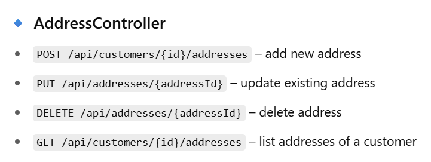

1. Customer table has 1 id and 3 main fields, and 5 one-many relations to other tables. 
   -  @Data
      @Entity
      @Table(name = "Customer")
      public class Customer {
      // Getters and Setters
      @Id
      @GeneratedValue(strategy = GenerationType.IDENTITY)
      @Column(name = "customerId")
      private Long customerId;

      @Column(name = "firstName", nullable = false)
      private String firstName;

      @Column(name = "lastName")
      private String lastName;

      @Column(name = "gender")
      private String gender;

      @OneToMany(mappedBy = "customer", cascade = CascadeType.ALL, orphanRemoval = true, fetch = FetchType.LAZY)
      private List<Address> addresses;

      @OneToMany(mappedBy = "customer", cascade = CascadeType.ALL, orphanRemoval = true, fetch = FetchType.LAZY)
      private List<AccountInfo> accounts;

      @OneToMany(mappedBy = "customer", cascade = CascadeType.ALL, orphanRemoval = true, fetch = FetchType.LAZY)
      private List<Communication> communications;

      @OneToMany(mappedBy = "customer", cascade = CascadeType.ALL, orphanRemoval = true, fetch = FetchType.LAZY)
      private List<DOB> dobs;

      @OneToMany(mappedBy = "customer", cascade = CascadeType.ALL, orphanRemoval = true, fetch = FetchType.LAZY)
      private List<KitInfo> kits;
   - 🔹 Simple Columns (3 fields)
     These are mapped **directly to table columns**:
     customerId (Primary Key), firstName, lastName, gender
   - 🔹 Relationships / Collections (5 fields)
     These represent child entities in a one-to-many relationship:
     - addresses → List<Address>
     - accounts → List<AccountInfo>
     - communications → List<Communication> 
     - dobs → List<DOB>
     - kits → List<KitInfo>
2. 
3. 
4. 
5. What data you need to insert into customer 
   - To insert into the Customer table, you only need 4 fields of data — because only those 4 are actual columns in the Customer table:
   - 🔁 The other 5 (like addresses, accounts, etc.) are not needed unless you are:
   - _Populating the child tables (address, account_info, etc.) at the same time._
   - **Performing a full insert via Customer object with nested children using JPA and cascading**.
6. Example 1: Just inserting Customer
   {
   "firstName": "Priya",
   "lastName": "Sharma",
   "gender": "F"
   }
   → This is enough for customerRepository.save(customer).
7. Example 2: Insert Customer with addresses/accounts/etc.
   {
   "firstName": "Priya",
   "lastName": "Sharma",
   "gender": "F",
   "addresses": [...],
   "accounts": [...],
   ...
   }
   → This requires the full structure with correct foreign keys and cascades.
8. Child entities have customer id as non-nullable filed and as a FK column. 
   - So, child tables can not exist without having associated to a customer object.
9. API design for easier operations 
   - ✅ You Should Have Both: This is very practical, realistic, and often required in large systems.
   1. Parent-level APIs (CustomerController)
      Create, update, delete, and get full customer with nested child entities.
      Use this when the entire customer object (including addresses, accounts, etc.) is being created or updated in one go.

   2. Child-level APIs (AddressController, AccountController, etc.)
      For individual operations on child entities (like adding a new address, updating phone number, deleting a card, etc.)
10. 
11. 
12. 

