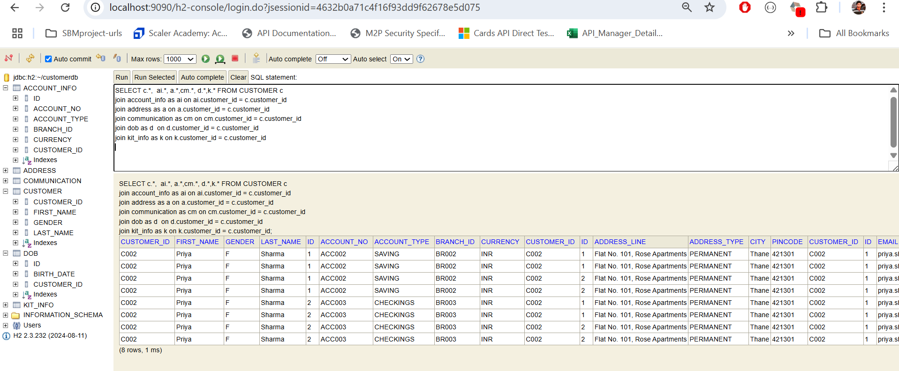
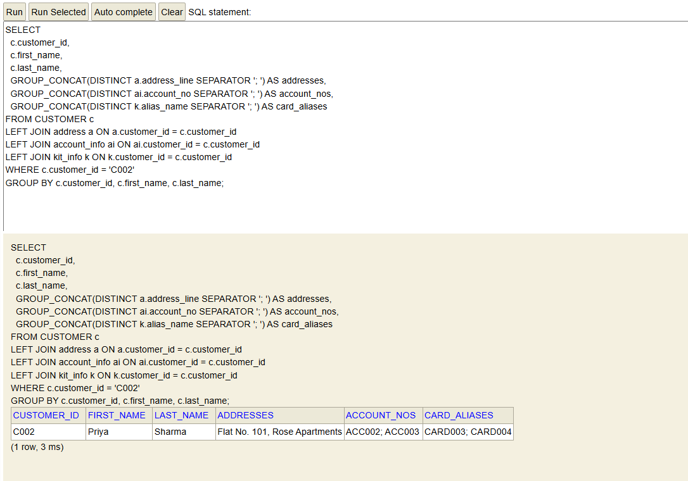

Many-to-Many uses @JsonIgnoreProperties("Join_Table")
-Student is one-to-many to enrollments, independent entity.
@JsonIgnoreProperties("students")
-Course is one-to-many to enrollments, independent entity.
@JsonIgnoreProperties("courses")
-Enrollments depends on both student and course, in many-to-many.
- Also include @JsonIgnoreProperties("enrollments")
- When you want to query enrollments, you need studentId, courseId exist. 
-Both student and course findById, return optional. 
-  Student student = studentRepo.findById(studentId).orElseThrow();
- Other-wise get an exception.
4.@Column vs @JoinColumn(name = "customerId", nullable = false)
- Join column is used for joining the referenced object by using the pk of that object.
- This references to the FK of the child table. 
====> Load data into H2 using data.sql at the start up of app. YOu can directly start querying on H2. 
- one customer has addresses, accounts,cards example. 
1. Use H2 in memory database. Do set up using yaml config. 
2. Create a folder in some location in local machine, as testdb or customerdb. 
3. Reference to that location from JDBC URL -
   datasource:
   url: jdbc:h2:file:C:/Users/mf11475/customerdb #by defualt it will be test, you can create a folder as needed in root locn.
4. access it on console as h2/~customerdb
5. join multiple tables with customer as parent and all other tables which allow many entries for one customer. 
6. SELECT ai.*, a.*,cm.*, d.*,k.* FROM CUSTOMER c
   join account_info as ai on ai.customer_id = c.customer_id
   join address as a on a.customer_id = c.customer_id
   join communication as cm on cm.customer_id = c.customer_id
   join dob as d  on d.customer_id = c.customer_id
   join kit_info as k on k.customer_id = c.customer_id
7. Look for how many rows for each customer - 
8. 
9. One customer with two accounts, two cards, two addresses has cartesian products 2*2*2 = 8 rows of data.
-- Customer basic info
SELECT * FROM CUSTOMER WHERE customer_id = 'cust002';

-- Addresses for customer
SELECT * FROM address WHERE customer_id = 'cust002';

-- Accounts for customer
SELECT * FROM account_info WHERE customer_id = 'cust002';

-- Cards (kit_info) for customer
SELECT * FROM kit_info WHERE customer_id = 'cust002';
10. Best way to group data into arrays of addresses,account_nos,cards is using group_concat function.
-SELECT
    c.customer_id,
    c.first_name,
    c.last_name,
    GROUP_CONCAT(DISTINCT a.address_line SEPARATOR '; ') AS addresses,
    GROUP_CONCAT(DISTINCT ai.account_no SEPARATOR '; ') AS account_nos,
    GROUP_CONCAT(DISTINCT k.alias_name SEPARATOR '; ') AS card_aliases
    FROM CUSTOMER c
    LEFT JOIN address a ON a.customer_id = c.customer_id
    LEFT JOIN account_info ai ON ai.customer_id = c.customer_id
    LEFT JOIN kit_info k ON k.customer_id = c.customer_id
    WHERE c.customer_id = 'C002'
    GROUP BY c.customer_id, c.first_name, c.last_name;
11. 

12. Json will be formatted as below - for bth post and get apis
- {
    "customerId": "C002",
    "firstName": "Priya",
    "lastName": "Sharma",
    "gender": "F",
    "addressInfo": [
        {
            "id": 1,
            "addressType": "PERMANENT",
            "addressLine": "Flat No. 101, Rose Apartments",
            "city": "Thane",
            "pincode": "421301"
        },
        {
            "id": 2,
            "addressType": "PERMANENT",
            "addressLine": "Flat No. 101, Rose Apartments",
            "city": "Thane",
            "pincode": "421301"
        }
    ],
    "accountInfo": [
        {
            "id": 1,
            "accountNo": "ACC002",
            "accountType": "SAVING",
            "currency": "INR",
            "branchId": "BR002"
        },
        {
            "id": 2,
            "accountNo": "ACC003",
            "accountType": "CHECKINGS",
            "currency": "INR",
            "branchId": "BR003"
        }
    ],
    "communicationInfo": [
        {
            "id": 1,
            "phone": "+919876543210",
            "email": "priya.sharma@gmail.com"
        }
    ],
    "dateInfo": [
        {
            "id": 1,
            "birthDate": "1980-03-22"
        }
    ],
    "kitInfo": [
        {
            "id": 1,
            "cardType": "PHYSICAL",
            "cardCategory": "DEBIT",
            "cardStatus": "ACTIVE",
            "aliasName": "CARD003"
        },
        {
            "id": 2,
            "cardType": "VIRTUAL",
            "cardCategory": "CREDIT",
            "cardStatus": "ACTIVE",
            "aliasName": "CARD004"
        }
    ]
}
13. Sample API Calls
1. Create Students
   - POST /api/students
   {
   "name": "Alice"
   }
2. Create Courses
   - POST /api/courses
   {
   "title": "Mathematics"
   }
3. Enroll a student in a course
   - POST /api/enroll?studentId=1&courseId=1&grade=A
4. Multiple students accessed by students/id , has multiple enrollments. git add
5. Get all enrollments of a student
   GET /api/students/1/enrollments
   GET /api/students/2/enrollments
6. ✅ To make Enrollment dependent on Student and Course (i.e., must always have both):
   We should mark the associations as non-nullable like this:

@ManyToOne(optional = false)
@JoinColumn(nullable = false)
private Student student;

@ManyToOne(optional = false)
@JoinColumn(nullable = false)
private Course course;
This enforces that:
You cannot insert an enrollment unless both student_id and course_id are provided.

So yes, Enrollment becomes dependent on both Student and Course.
7. 🔁 Optional Cascade?
- If you want deleting a Student to also delete related Enrollment records, you add:

In Student.java:
@OneToMany(mappedBy = "student", cascade = CascadeType.ALL, orphanRemoval = true)
private List<Enrollment> enrollments = new ArrayList<>();
Same for Course if needed.

8. org.springframework.orm.jpa.JpaSystemException: A collection with orphan deletion was no longer referenced by the owning entity instance
- **means Hibernate tried to delete orphaned child entities**, but the parent entity no longer had a reference to the original collection, which caused an issue.

# - @OneToMany(mappedBy = "customer", cascade = CascadeType.ALL, **orphanRemoval = true**)
  private List<Account> accounts;
